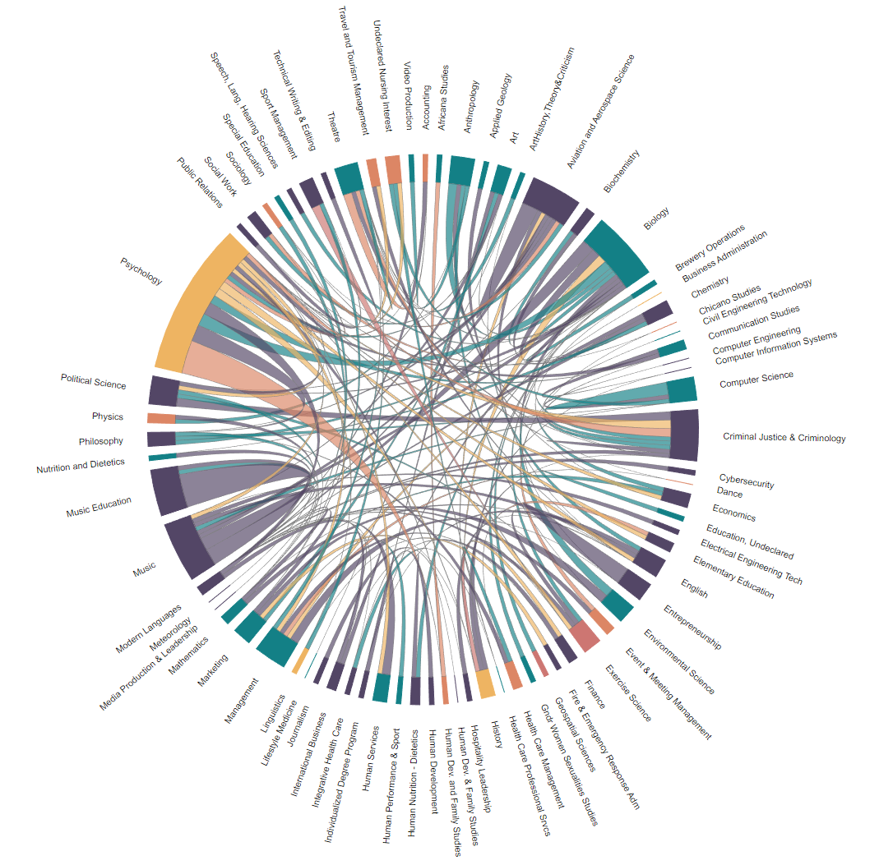

# R Chord Diagram

Just some simple R code and a sample dataset for generating a chord diagram.

This example depicts common double-majors we typically see grouped together, colored by the home college of where the primary major is housed (e.g. the Accounting major resides within the College of Business). 

In its current format, it's a rather cluttered visualization that would be better served by paring down the data set and focusing on the heaviest hitters. 

